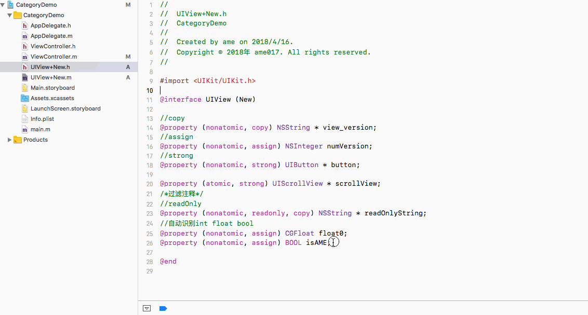
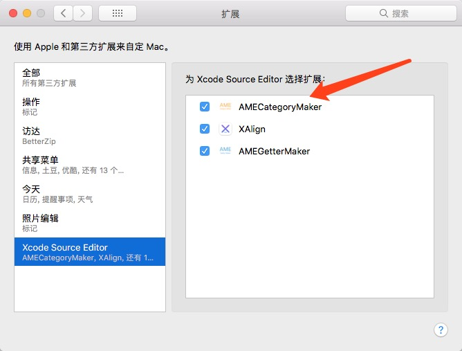
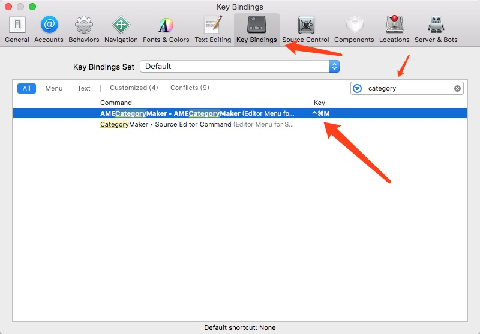

# AMECategoryMaker
一个无需resign Xcode的category生成器<br>


## 关于本扩展
当你新建一个category并为他添加新的property之后，你必须手动实现getter和setter。
安装这个插件会帮你自动实现这些

例如：
```
//copy
@property (nonatomic, copy) NSString * view_version;
//assign
@property (nonatomic, assign) NSInteger numVersion;
//strong
@property (nonatomic, strong) UIButton * button;

@property (atomic, strong) UIScrollView * scrollView;
/*过滤注释*/
//readOnly
@property (nonatomic, readonly, copy) NSString * readOnlyString;
//自动识别int float bool
@property (nonatomic, assign) CGFloat float0;
@property (nonatomic, assign) BOOL isAME;
```
↓↓↓
```
static char * view_versionKey = "view_versionKey";
static char * numVersionKey = "numVersionKey";
static char * buttonKey = "buttonKey";
static char * scrollViewKey = "scrollViewKey";
static char * readOnlyStringKey = "readOnlyStringKey";
static char * float0Key = "float0Key";
static char * isAMEKey = "isAMEKey";

- (void)setView_version:(NSString *)view_version{
    objc_setAssociatedObject(self, view_versionKey, view_version, OBJC_ASSOCIATION_COPY_NONATOMIC);
}

- (NSString *)view_version{
    if(!objc_getAssociatedObject(self, view_versionKey)){
        NSString *object = [[NSString alloc]init];
        objc_setAssociatedObject(self, view_versionKey, object, OBJC_ASSOCIATION_COPY_NONATOMIC);
    }
    return objc_getAssociatedObject(self, view_versionKey);
}

- (void)setNumVersion:(NSInteger)numVersion{
    objc_setAssociatedObject(self, numVersionKey, @(numVersion), OBJC_ASSOCIATION_ASSIGN);
}

- (NSInteger)numVersion{
    return [objc_getAssociatedObject(self, numVersionKey)integerValue];
}

- (void)setButton:(UIButton *)button{
    objc_setAssociatedObject(self, buttonKey, button, OBJC_ASSOCIATION_RETAIN_NONATOMIC);
}

- (UIButton *)button{
    if(!objc_getAssociatedObject(self, buttonKey)){
        UIButton *object = [[UIButton alloc]init];
        objc_setAssociatedObject(self, buttonKey, object, OBJC_ASSOCIATION_RETAIN_NONATOMIC);
    }
    return objc_getAssociatedObject(self, buttonKey);
}

- (void)setScrollView:(UIScrollView *)scrollView{
    objc_setAssociatedObject(self, scrollViewKey, scrollView, OBJC_ASSOCIATION_RETAIN);
}

- (UIScrollView *)scrollView{
    if(!objc_getAssociatedObject(self, scrollViewKey)){
        UIScrollView *object = [[UIScrollView alloc]init];
        objc_setAssociatedObject(self, scrollViewKey, object, OBJC_ASSOCIATION_RETAIN);
    }
    return objc_getAssociatedObject(self, scrollViewKey);
}

- (NSString *)readOnlyString{
    if(!objc_getAssociatedObject(self, readOnlyStringKey)){
        NSString *object = [[NSString alloc]init];
        objc_setAssociatedObject(self, readOnlyStringKey, object, OBJC_ASSOCIATION_COPY_NONATOMIC);
    }
    return objc_getAssociatedObject(self, readOnlyStringKey);
}

- (void)setFloat0:(CGFloat)float0{
    objc_setAssociatedObject(self, float0Key, @(float0), OBJC_ASSOCIATION_ASSIGN);
}

- (CGFloat)float0{
    return [objc_getAssociatedObject(self, float0Key)doubleValue];
}

- (void)setIsAME:(BOOL)isAME{
    objc_setAssociatedObject(self, isAMEKey, @(isAME), OBJC_ASSOCIATION_ASSIGN);
}

- (BOOL)isAME{
    return [objc_getAssociatedObject(self, isAMEKey)boolValue];
}
```



## 安装说明
#### Xcode8.0+
1. [点我下载本扩展](Product/AMECategoryMaker.zip)<br>
2. 在系统偏好设置-扩展中打开本插件(如图)<br>
<br>
3. 你可以自己设置一个快捷键 <br>
<br>

## 一些提示
如果您的Xcode版本是 8.0+但是无法使用<br>
请安装macOS Sierra (version 10.12)<br>

## 其他项目推荐
[AMEGetterMaker](https://github.com/ame017/AMEGetterMaker) <br>
一个无需resign Xcode的懒加载插件
